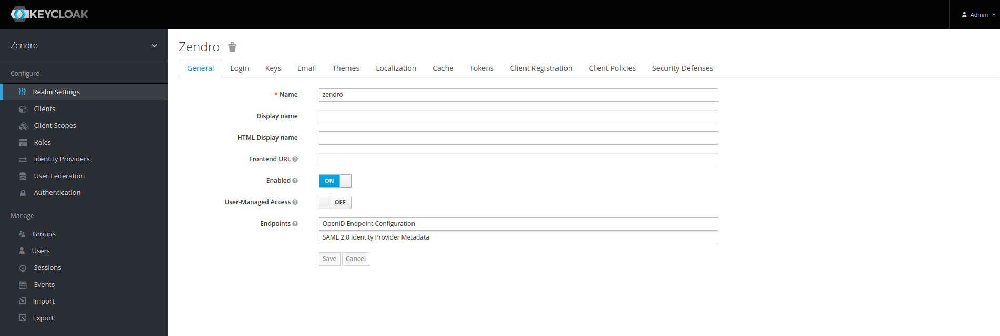
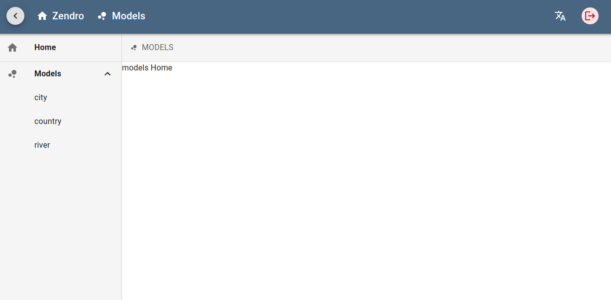
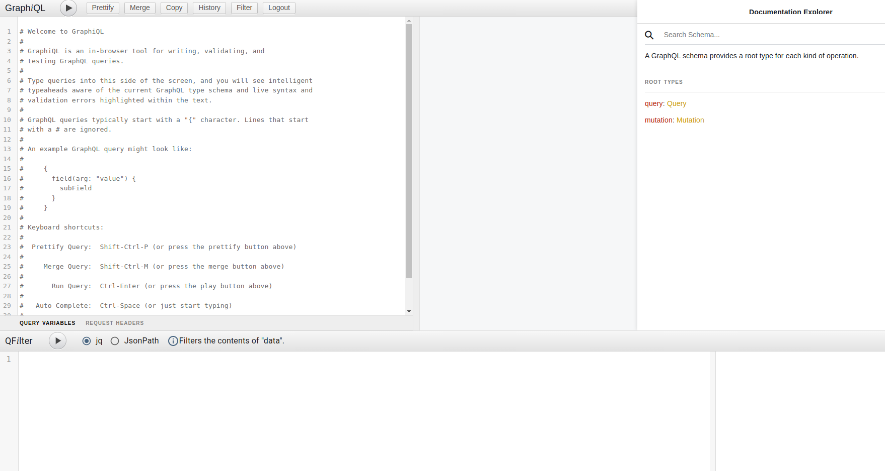

[ &larr; back](README.md)
<br/>
# Getting started

This is a step-by-step guide on how to create a new Zendro project from scratch, aimed at software developers and system administrators.

Zendro consists of four source-code projects: __graphql-server-model-codegen__, __graphql-server__, __single-page-app__ and __graphiql-auth__. The first pair is responsible for the back-end [GraphQL](https://graphql.org/learn/) service that can be accessed on the default url http://localhost:3000/graphql on development mode or http:localhost/api/graphql on production mode. As the names of this project say, the *codegen* suffix means that to pull up the corresponding server it is required to generate some code first. Among inter-database transparency, the code generation step also allows a Zendro user to automate routinary ORM programming that depends on data scheme. The third project acts as a client of the GraphQL server and creates a simple generic web-based GUI for this server on the url http://localhost:8080/spa on development mode or http:localhost/spa on production mode. The last project offers a Zendro specific implementation of the browser based GraphQL IDE [Graphiql](https://github.com/graphql/graphiql). The project is a simple [Next.js](https://nextjs.org/) application. Custom adjustments have been made to accomodate Zendro requirements for authentication of users and enhanced meta searches using [jq](https://stedolan.github.io/jq/) or [JSONPath](https://goessner.net/articles/JsonPath/) statements.

 <br/>

## Project Requirements:
 * [NodeJS](https://nodejs.org/en/) 

 **recommended for setting up zendro using docker**
 * [docker](https://docs.docker.com/get-docker/)
 * [docker-compose](https://docs.docker.com/compose/install/#install-compose)
 <br/><br/>

* * *
## Step by step guide

### Step 1: Installation

Execute this commands to install Zendro:

```
$ git clone https://github.com/Zendro-dev/zendro.git
$ cd zendro
$ npm install
$ npm link
```

### Step 2: Setup a new Zendro project

The easiest way to set up Zendro is using the [Zendro CLI tool](https://github.com/Zendro-dev/zendro). With minimal steps and configuration a Zendro warehouse taylored to your data needs can be deployed. Execute:

```
# "-d" adds Dockerfiles to fully dockerize running zendro 
$ zendro new -d <my-project-name> 
```

### Step 3: Edit environment variables

Go inside the new project and modify the selected enviroment variables in the next files. These files have a default configuration, please remember to add your expected secret word in the *NEXTAUTH_SECRET* variable.

* **Without docker setup:** ./graphql-server/config/data_models_storage_config.json
* **With docker setup:** ./config/data_models_storage_config.json
* **SPA in development mode:** ./single-page-app/.env.development
* **SPA in production mode:** ./single-page-app/.env.production
* **GraphiQL in development mode:** ./graphql-server/.env.development
* **GraphiQL in production mode:** ./graphql-server/.env.production
  If you would like to upload a file to a remote server, please consider the template *.env.migration.sample*, create a new file *.env.migration* and modify relevant environment variables.

If you wish to know more about enviroment variables you can check [this](env_vars.md).

### Step 4: Define your data models

Add your model definitions in JSON files to `./data_model_definitions` folder.

If you want to learn more about how to define data models with Zendro, please check [this](setup_data_scheme.md).

### Step 5: Generate code and migrations

After setting up your data models use the next command to generate the model-specific code and fill your Zendro skeleton project with life.

```
$ zendro generate -m
```

This will automatically generate all basic create, read, update and delete (CRUD) operations for each data model specified in the scheme from the previous step.

Also, this will create migration files. By default, every migration file has two functions, namely *up* and *down*. The *up* function creates a table, the *down* function deletes the existing table. Furthermore it is possible to customize the migration functions. Please check [this](zendro_cli.md) to learn more about migrations.

***CONNECT TO OWN DB IS MISSING*** 

### Step 6: Start up Zendro 

<!----><a name="start"></a>

[](#start)

The recommend way to [run your Zendro instance is via docker](https://zendro-dev.github.io/zendro_cli.html#dockerize-zendro-app-with-example-docker-files). This ensures that regardless of your local infrastructure Zendro will behave the same.
```
$ zendro dockerize -u 
```

Moreover, if you would like to use production mode, please execute:
```
$ zendro dockerize -u -p
```

This command will create docker containers for each Zendro component:
* [Keycloak](https://github.com/Zendro-dev/Zendro-dev.github.io/blob/documentation-vb/oauth.md): manage users and roles
* [Single Page App (SPA)](https://github.com/Zendro-dev/single-page-app): graphical interface to send CRUD requests to a Zendro GraphQL endpoint
* [API](https://github.com/Zendro-dev/graphql-server): CRUD API that can be accessed through a GraphQL query language
* [API with authenthication](https://github.com/Zendro-dev/graphiql-auth): An implementation of the GraphQL IDE with Zendro login

You can check docker containers by:
```
$ docker ps
```

You can check docker logs by:
```
$ docker logs -f <container name>
```

> ***Please wait until logs indicate the app is running on XXXX port to access Zendro services.***

In default config, the running containers will be:

* Keycloak: 
    * Development mode: http://localhost:8081/auth
    * Production mode: http://localhost/auth/
    
      * The default keycloak username is *admin* and the password is *admin*.

  
  

* SPA: 
    * Development mode: http://localhost:8080/spa
    * Production mode: http://localhost/spa

      * The default zendro username is *zendro-admin* and the password is *admin*.

  
  

* GraphQL API: 
    * Development mode: http://localhost:3000/graphql
    * Production mode: http://localhost/api/graphql 

  

* GraphQL API with filter functionality: 
    * Development mode: http://localhost:7000/graphiql
    * Production mode: http://localhost/graphiql

      * The default zendro username is *zendro-admin* and the password is *admin*.

  
  


If you wish to modify the default ports, adjust next files:
> [Stop Zendro Instance](#stop), modify files and [start Zendro Instance](#start) again.

* ./docker-compose-prod.yml
* ./docker-compose-dev.yml
* ./single-page-app/.env.production
* ./single-page-app/.env.development
* ./single-page-app/package.json
* ./graphql-server/.env
* ./graphiql-auth/.env.development
* ./graphiql-auth/.env.production
* ./graphiql-auth/package.json

Also, if you wish to modify docker containers name or docker services names, adjust next files:
> [Stop Zendro Instance](#stop), modify files and [start Zendro Instance](#start) again.

* ./docker-compose-prod.yml
* ./docker-compose-dev.yml

Moreover, if you wish to modify keycloak IP adjust:
* ipv4_address
* subnet

in *./docker-compose-prod.yml* and *./docker-compose-dev.yml*.

<!----><a name="nodocker"></a>
[](#nodocker)

If you prefer to use local setup with Keycloak, there are a few things to do after running Zendro:

***MISSING***

* install java
* Install keycloak
* Env vars and where to find them in keycloak, screenshots.
* logs


### Step 7: Start up Zendro with access control 
Zendro can be used checking access rights for every single GraphQL query received by the currently logged in user identified by the Token. The user is decoded and his roles are loaded to check his access rights. This step is carried out by the [NPM acl package](https://www.npmjs.com/package/acl). Respective access rights can and must be declared in the file `./graphql-server/acl_rules.js`.

You can run Zendro with or without this access control check. The default is to run it without checking access rights.

To switch access right check on, you must uncomment the command line switch acl and change the following line in `./graphql-server/migrateDbAndStartServer.sh`

```
npm start #acl
```
to 
```
npm start acl
```

Moreover, if you decide not to use access control, you can restrict the user permissions using the enviroment variable *WHITELIST_ROLES*. For example, if you wish users only can do reading querys, in `./graphql-server/.env` file modify:

```
WHITELIST_ROLES="reader"
```

You can add all roles you wish separating them with a comma.


<!----><a name="stop"></a>
### Step 8: Stop Zendro instance
Execute the next command to stop Zendro and remove all volumes.
```
$ zendro dockerize -d -v
```

If you are on production mode execute:
```
$ zendro dockerize -d -p -v
```


### Customize your project (optional)

A couple of basic extensions are suggested to be introduced directly into the GraphQL server code. These are: *data validation logic* and *GraphQL query/mutation patches*. To implement custom logic of these extensions some programming is required, however this step is well confined and described.  

Furthermore the whole codebase used to run zendro is exposed an can be directly customized if needed. That is true for the graphql-server as well as the frontend applications.

[ > Advanced code customizing](setup_customize.md)
